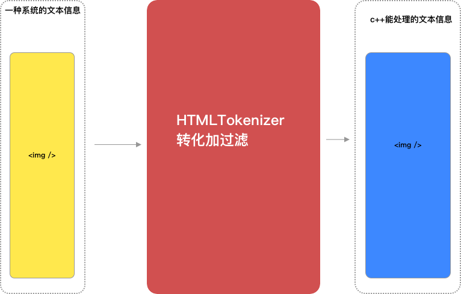

### 前言
> 基于对之前的一版不太满意的原因的下，今天做了两张图细化一下。同时更想说清楚为什么会出现vdom，以及进行react和vue的跨平台方案的切入点到底在哪里。看多端方案和vdom之前其实还是有必要去看原始web开发的实际生产中怎么做到从html，js到浏览器应用的这个过程，这个对于多端方案的理解是有很大帮助，现有多端方案细化的点不是很清楚，但是在大的架构方面都是相差不大的。

##### web端开发的本质
这个不是从应用来看，只是单纯的从技术方案看。首先web应用其实可以解释成浏览器的子产品和小程序如出一辙，只是宿主平台不一样。首先企业或用户的产品都是运行在同一个应用上的，chrome本身就是一个产品你开多少个浏览器访问多少个网站都是在这个宿主上去做事情。在浏览器这层它是一个用户操作行为的抽象应用是不涉及具体实际业务的。它只是增强了一个应用的通用功能网站都需要下载资源响应用户的操作行为,后退,前进,鼠标点击,输入,渲染图像,调用摄像头，至于是付款表单输入的是什么信息输入的是什么信息这些解释浏览器这个系统的边界了。web应用是纯业务的开发，面向用户的实际操作业务。html与js只是一种与浏览器通信的手段让开发者在最小程度上参与浏览器的生产过程。所以，web前端这个职业很大程度是因为互联网产品爆棚而浏览器又将复杂的底层操作进行了抽象能实现快速迭代才产生的一个职业，产品需求不减的话就会存在。

##### 浅聊浏览器的架构方案
我其实是一直是想转其他的端，但是却一直未有实现。于是就只能平时看看这方面的知识附带着写写fultter之类的。还没有学会fultter但是却对于web应用本身有点认识了，对于技术学习我觉得其实围点打援可能是比较好的方式，用其他领域的知识完善对于本领域的认识。
<div align=center>
</div>
这个是webkit的整体架构方式，从系统方式看web应用或者说浏览器应用它是四个系统的对接分别是视图系统，内核系统，脚本系统，操作系统。脚本系统其实是不与文档系统直接对接的。文档系统的作用在哪里就只在初始化视图时用到，剩下的我们看到的dom数据实质是从内核中映射出来的初始数据剩下的操作也都是通过脚本调用系统外放的api操作内部的视图数据的。
###### morphology
这个名字随便取的，它也是一个系统用来做html文本到node类的对接的，这是一个视图语言转化的过程包含词法分析。用过xml就知道了，用一种结构去描述数据信息。
```
### 首先接收到一端html文本

左右标签描述的是起始与结束，词法分析会做相应的操作
### 读取文档信息遇到起始标签开始分析
function(dom) {
    ### 首先第一个是标签的类型，img类型，img类型表示需要解析的是图片信息
    ### img的底层会继承支持图片处理的类
    ### 读到第二个属性 src知道src是一个地址信息，去寻址下载或加载本地资源总之是io操作了，一个src背后包含的信息是一个操作过程
    ### 依次读取知道结束,在未加载完资源之前已经实例话img这个数据对象
}
### 用js模拟一个img类,当然js没有多继承只是模拟一个过程语言的特点只是一种方式
class src extends Io {
    constructor(src) {
        super();
        this.src = src;
        this.loading = false;
        this.data = null;
        this.init();
    }

    async init() {
        this.data = await fetch(src);
        this._onload(this.data);
    }

    onload(fun) {
        this._onload = fun;
    }

    _onload(data) {}

}

class img extends src, alt {
    constructor(src, alt) {
        super(src, alt);
    }
}

function func(string) {
    if (type === img) {
        new img(string[1], string[2])
    }
}
```
词法分析的主要功能是将文本记录的信息初始成一个个node类实例数据，内核gui根据这些信息去刷染出视图。内核如果支持了一个功能其实在html语言上支持一个标签其实是很容易的，难道是背后的这个动作。这个就是所谓的视图语言，表达的是底层的过程。在架构方面词法分析模块对接的是html文本和node类。在解析器这个系统中操作数的输入的html，最后产出的视图数据。

<div align=center>
</div>

##### node系统
node类是从前端html，js脚本到系统层面实现的对接者。这个系统比较复杂目前webkit的源码也就大概看了一点点有一个大概认识，只能单从event部分来看这个也是我们最频繁涉及的。webkit的实现就是非常典型的oop方式，通过一个父类扩充了node类的功能，从webkit去学习的话目前了解到oop中所做的大系统拆分小系统的方式，大致就像node这种方式将具体功能拆分成一个个小的父类，每个父类负责一块功能。
<div align=center>
</div>
<div align=center>
</div>
实现event到前端的通信依赖于从node注入到JScord宿主window中的一些api功能，这个放到后面js引擎到node的对接。如何从完成从node类到sys事件的通信呢，通过继承event类去实现。event类的功能界限很明确接受输入信息，注册监听维护一个监听对象，每当有从系统来的事件触发时，通知相应的监听然后执行回调函数。
<div align=center>
</div>

