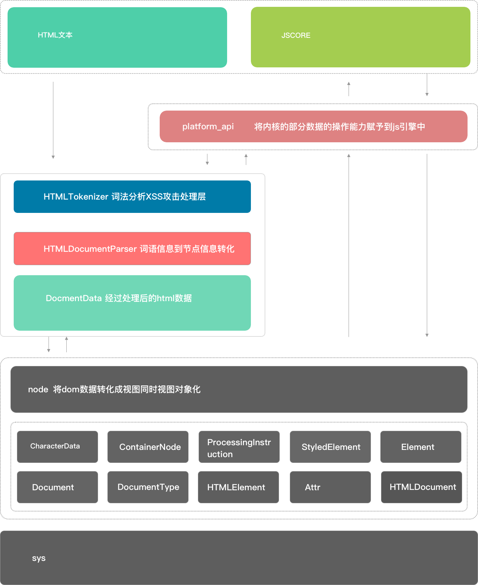

### 前言
> 基于对之前的一版不太满意的原因的下，今天做了两张图细化一下。同时更想说清楚为什么会出现vdom，以及进行react和vue的跨平台方案的切入点到底在哪里。看多端方案和vdom之前其实还是有必要去看原始web开发的实际生产中怎么做到从html，js到浏览器应用的这个过程，这个对于多端方案的理解是有很大帮助，现有多端方案细化的点不是很清楚，但是在大的架构方面都是相差不大的。

##### web端开发的本质
这个不是从应用来看，只是单纯的从技术方案看。首先web应用其实可以解释成浏览器的子产品和小程序如出一辙，只是宿主平台不一样。首先企业或用户的产品都是运行在同一个应用上的，chrome本身就是一个产品你开多少个浏览器访问多少个网站都是在这个宿主上去做事情。在浏览器这层它是一个用户操作行为的抽象应用是不涉及具体实际业务的。它只是增强了一个应用的通用功能网站都需要下载资源响应用户的操作行为,后退,前进,鼠标点击,输入,渲染图像,调用摄像头，至于是付款表单输入的是什么信息输入的是什么信息这些解释浏览器这个系统的边界了。web应用是纯业务的开发，面向用户的实际操作业务。html与js只是一种与浏览器通信的手段让开发者在最小程度上参与浏览器的生产过程。所以，web前端这个职业很大程度是因为互联网产品爆棚而浏览器又将复杂的底层操作进行了抽象能实现快速迭代才产生的一个职业，产品需求不减的话就会存在。

#### 浅聊浏览器的架构方案
我其实是一直是想转其他的端，但是却一直未有实现。于是就只能平时看看这方面的知识附带着写写fultter之类的。还没有学会fultter但是却对于web应用本身有点认识了，对于技术学习我觉得其实围点打援可能是比较好的方式，用其他领域的知识完善对于本领域的认识。
<div align=center>
</div>
<br/>
<br/>
这个是webkit的整体架构方式，从系统方式看web应用或者说浏览器应用它是四个系统的对接分别是视图系统，内核系统，脚本系统，操作系统。脚本系统其实是不与文档系统直接对接的。文档系统的作用在哪里就只在初始化视图时用到，剩下的我们看到的dom数据实质是从内核中映射出来的初始数据剩下的操作也都是通过脚本调用系统外放的api操作内部的视图数据的。
```
### 我们说的文档数据到到视图的对接，其实图片也是一种一种文档只是对接的是图片解析器，如果你找一个不支持展示图片的编辑器会发现图片其实是这样的
0101 1100 0010 ...
1111 0000 1001 ...
### 具体它的解析器规则假设0101代表的是rgba中的每一个，而这每四个构成一个像素的表达,它就是一个屏幕图像信息的表示了。
### 表达方式可以是任何形式，只要有对应的解释器
```
###### HTMLTokenizer
HTMLTokenizer是内核中的一个c++类，用来做词法分析检验文档词法的合法性。是从字节流到特定格式的字符串。网页头部设置的utf-8之类的就是帮助词法分析器去做字节处理的，内置的nextToken函数会循环去读每读取一段就标记一段的处理状态并输出一个解释的词语。
<br/>
<div align=center>
    
    
</div>
<br/>
可以说这一部分的功能主要是用来做语言转换的，同时负责做一个词法的合法性检验也就是xss。
<br/>
<br/>
<div align=center>
</div>
<br/>
##### HTMLDocumentParser
事实虽然HTMLDocumentParser与HTMLTokenizer是两个不同的小系统，但他们在整体里面所起到的作用是近似的都是在做前置数据的准备。一个负责检查转译筛选，一个负责将它转变成另一种形式，HTMLDocumentParser所做的工作就是将词语转成节点，用过node里的xml解析包的话他们功能就差不多，xml和html很像但是经过一下包之后就变成对象信息了。
```
 => { type: 'img', src: '....', .... }
```
HTMLDocumentParser内部调用的是HTMLTreeBuilder的constructTree方法进行词语到节点的转化，然后看c++的语法是真漂亮虽然多很多代码。其中很多这种std::是它的只能指针功能内部有有引用计数做垃圾回收。经过前两步处理完的数据最后的节点信息就是即将进行渲染的信息，html和js交互处理的实际上是这部分信息，比如在html加载的过程遇到js控制dom更改的过程。GUI和js访问的是同一个资源信息，GUI根据节点信息渲染dom，当js申请操作修改时节点信息就被锁住，GUI工作就需要被暂停，当js修改信息完成资源访问就被释放。
<br/>
<div align=center>
</div>
<div align=center>
</div>
<div align=center>
</div>
<br/>
##### node系统
node系统可以说是webkit最核心的功能，它赋予了js中的document下所有dom中的各种能力，调用底层注册事件等。不能完全看明白oop是什么，不过能学习到如何通过oop的方式去进行多系统的对接，可以把node与其他系统的连接看成下面这种形式。
<br/>
<div align=center>
</div>
<br/>
```
class Event {
    constructor() {
    }

    static queue = [];

    add() {...}

    remove() {...}
}

class GuI {
    constructor() {}

    static render() {
        sys.Gui()
    }

    start() {....}
    stop() {....}
}

class Src {
    constructor() {}

    Io(src) {
        sys.Io(src);
    }
}

class Node extends Event, GuI {
    constructor() { super(); }

    ....
}

// 函数
function main() {
    Io();
    Gui();
    Event();
}
```
node通过继承将各种能力添加到dom中，拆看来看单个父类的功能是很纯净的，其实函数和对象在业务功能上相近只是形式不同。在Event中自己维护和系统事件的对接，当监听到某一事件的触发，就调用注册的监听的控制器传入上层，在底层系统中的事件处理是没有目标的这个概念只有事件类型input类型事件click类型事件。这个处理方式也是对于本系统可控的方式的一点，系统的边界必须明确，比如从a-b的对接，其实我并不知道具体是a里面的谁要求做了这件事b也不需要只要如果b连谁做了也要分析的话今天有abc申请了明天有mgn申请了，那这也太头痛了我只需要知道自己能处理的是input操作click操作处理了就丢出去你自己找是谁申请的。所以到前端这边也就存在了捕获和冒泡这种东西。
<div align=center>
</div>
<div align=center>
</div>
<div align=center>
</div>
```
function add(a, b, c, d) {
    if (b == 条件) {
        
    }
    // 从一个系统到另一个系统的边界
    sys.add(a,b,c)
}
```
最后再回想conf上崔红保大佬说的不要频繁setData,以及为什么会出现vdom这个东西。由于js去直接操作dom不是在前端这边操作数据而是调用内核暴露出来的能力去修改内核中存储的dom节点信息。在信息不大的情况下其实都还好，大数据量的情况下相当于频繁的从a-b-c-d而且是从一个系统到另一系统的调用一个线程到另一个线程的通信。这个代价是高的，既然视图都是从数据去转成视图的，那前端先处理好视图数据最后集体调内核能力，vdom就是视图数据在前端的一种体现因为要做事件切片等优化在数据上又扩充了一些其他信息，react的feber架构中单个节点中出现的time信息就是一个例子。
#### vdom
vdom的模型是基于html转化出来的一种形式，最大程度在前端先操作好数据，然后集体做调用操作减轻内核压力。vdom的出现是对htmldom进行结构形式，前端操作到渲染操作的过程的一个提炼。相似的方式在力扣的岛屿计算这个题目上也有体现。
```
### 假设又一个二维数组0代表水1代表陆地，那么计算这片区域的岛屿数量
### 这个过程中最耗事件和内存的是在查找位置信息的过程中同时去找相邻的位置的信息
for（let i=0; i < grid; i ++） {
    for(let j=0; j < grid[i].length; j ++) {
        .....
    }
}
[0,1,1,1,0]
[1,1,1,0,0]
[0,1,1,0,1]
[0,0,0,0,0]
[1,1,1,0,1]
### 怎样才能把信息能挖掘的点全部给它榨干呢！
### 首先将二维数组给它展平
[0,1,1,1,0,1,1,1,0,0,0,1,1,0,1,0,0,0,0,0,1,1,1,0,1]
### 一维数组的索引是永远不会变的，在查找过程中替换数据也不会变
[0,2,2,2,0,2,2,2,0,0,0,2,2,0,14,0,0,0,0,0,20,20,20,0,24]
x = i%24, y = parseint(i/24);
### 所以一个i中就隐藏了权值，坐标这两个信息，并且始终又一个固定的i能找到自己
### vdom就相当与一维的dom就相当于原始的二维信息
```
<div align=center>
</div>
```
updatequeue = [vdom1, vdom2, vdom3, vdom4];
// 每个vdom包含扩展信息又包含原始信息，始终能根据原始信息找到对应的原始dom和调用原始dom的api
vdom = {
    dom: dom,
    time: 123,
    vdomobject: {}, 
}
当调用set的时候更新并推到队列里，如果一个时间片内的长度是5，那么当有5个更新节点时就一次推动更新。当然描述可能存在误差但是主要是想表明在这里面，先借助vdom做前置处理，左右反应结果到dom上。
```


